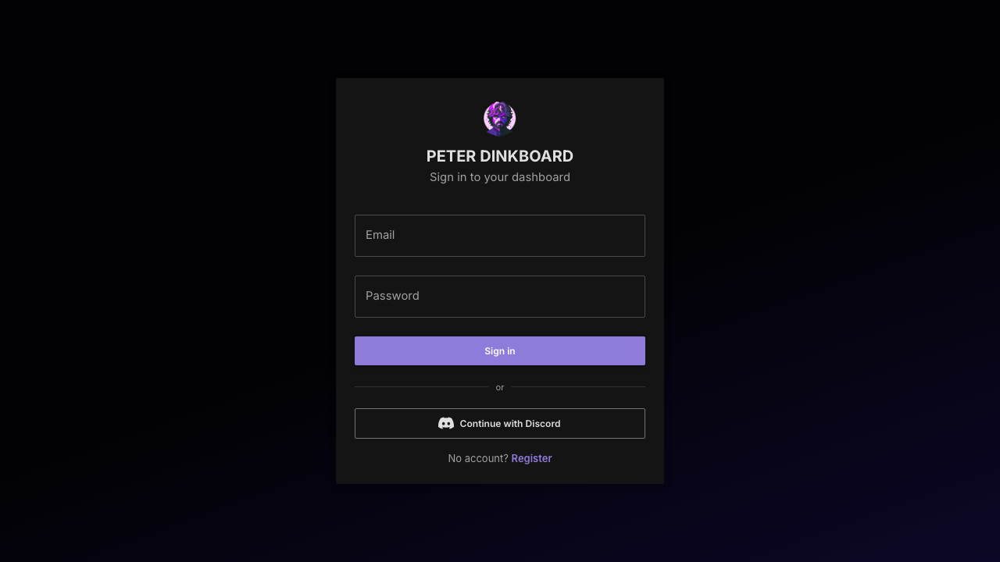
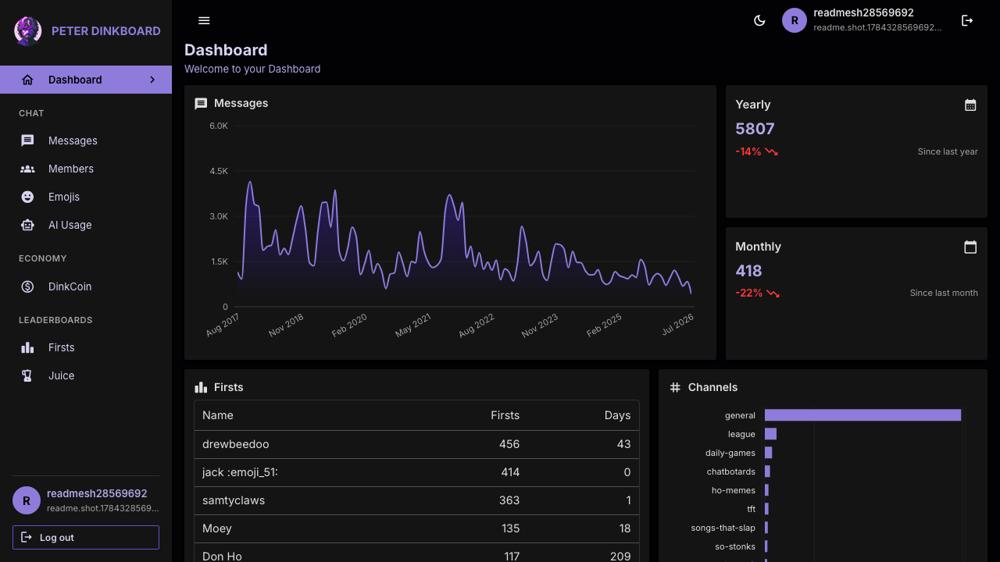
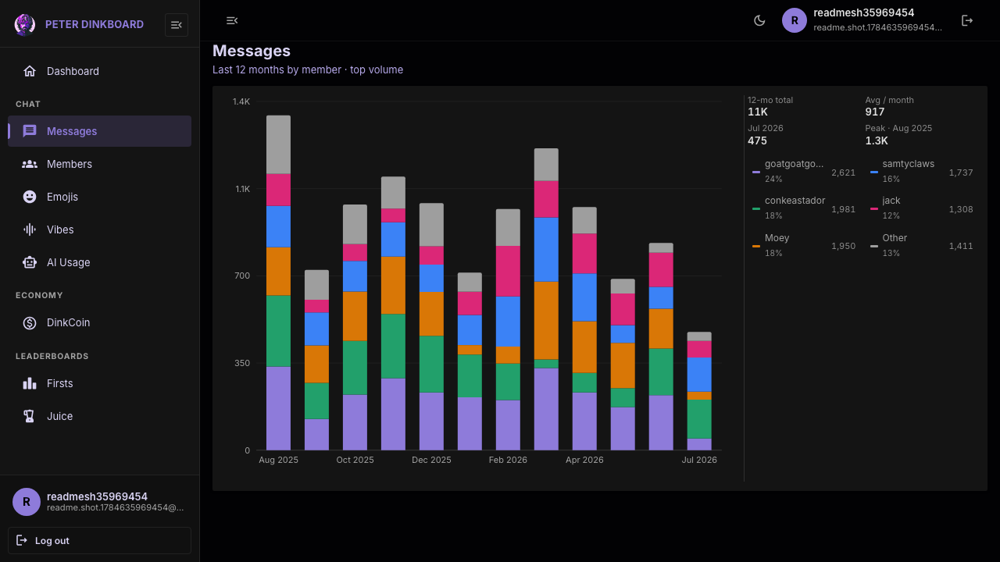
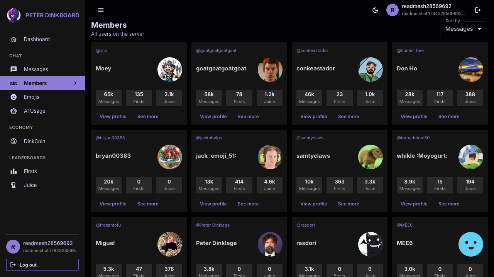
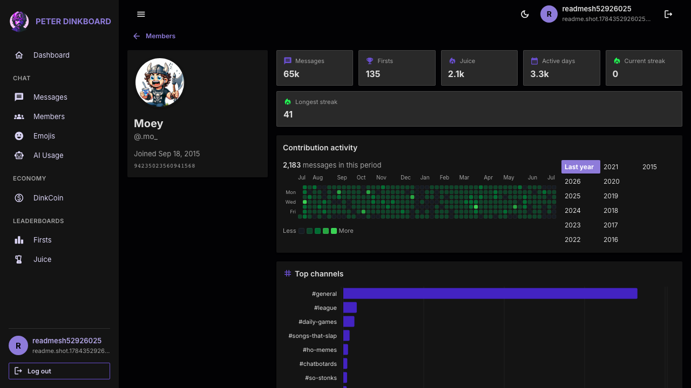
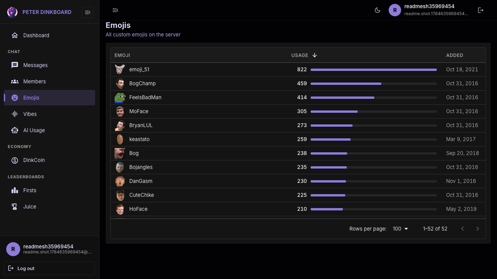
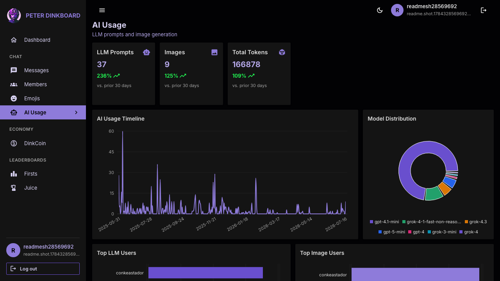
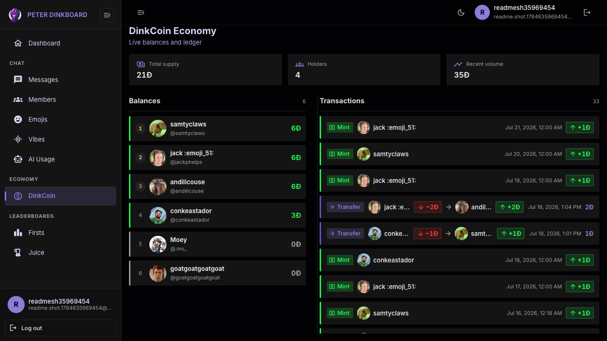
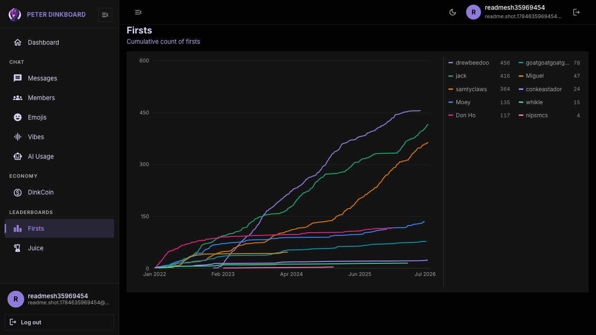
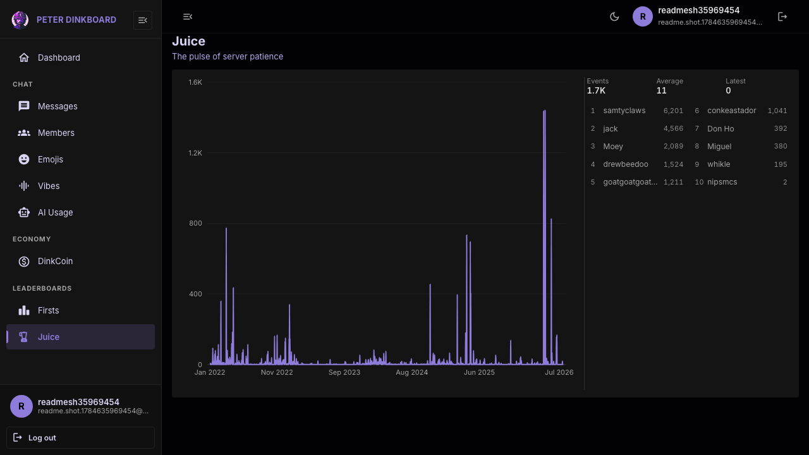

# Dinkboard

**[Live demo → dinkscord.com](https://dinkscord.com)**

A full-stack analytics dashboard for a private Discord community. It surfaces message volume, member activity, emoji usage, AI feature usage, an in-server economy, and community leaderboards — backed by a real MySQL dataset and a production deploy with CI/CD.

> Despite the repo folder name, this is **not** MongoDB/MERN. The API is Express + **MySQL**.

---

## Screenshots

Drop images into [`docs/screenshots/`](docs/screenshots/) using the filenames below.

### Login



Email/password auth plus Discord OAuth. Session is cookie-based (no tokens in `localStorage`).

### Dashboard



At-a-glance overview: message trends, channel breakdown, emoji mix, and firsts leaderboard.

### Messages



Top members by message volume over the last 12 months.

### Members



Browseable member directory with activity stats (messages, firsts, juice).

### Member profile



Per-member deep dive: contribution heatmap, channel breakdown, streaks, and summary stats.

### Emojis



Custom server emoji catalog with usage data.

### AI usage



ChatGPT / DALL·E usage stats — timelines, per-user breakdowns, and model mix.

### Economy (DinkCoin)



In-server currency balances and transaction history.

### Firsts



Cumulative “first of the day” leaderboard over time.

### Juice



Community “juice” metric — the pulse of server patience over time.

---

## What this project demonstrates

| Area | Implementation |
|---|---|
| **SPA dashboard** | React 18 + Vite, MUI 5, Recharts, responsive layout with dark/light theme |
| **API design** | Express REST API, Zod validation, consistent error envelope, read-heavy analytics queries |
| **Auth** | httpOnly JWT access + rotating refresh cookies; Discord OAuth; route guards on the client |
| **Data layer** | MySQL via `mysql2`, shared Discord ingest tables + app-owned `app_users` / `app_refresh_tokens` |
| **Client data** | Redux Toolkit + RTK Query (`credentials: 'include'`), loading/error/empty states |
| **Quality** | Vitest + Supertest API tests; Playwright auth smoke; GitHub Actions CI |
| **Ops** | Docker Compose, nginx reverse proxy, Caddy on VPS, automated deploy on `main` |

---

## Stack

| Layer | Tech |
|---|---|
| Client | React 18, Vite, MUI 5, Recharts, Redux Toolkit / RTK Query, React Router (`BrowserRouter`) |
| API | Node.js, Express, mysql2, argon2, JWT, Zod, helmet, express-rate-limit |
| Auth | `access_token` + `refresh_token` httpOnly cookies (Bearer fallback for tests/curl) |
| DB | MySQL |
| Deploy | Docker, nginx, Caddy, GitHub Actions → VPS |

---

## Architecture (short)

```
Browser (React SPA)
    │  cookies + CORS credentials
    ▼
Express API  ──►  MySQL (Discord analytics tables + app auth tables)
```

- **Access JWT** ~15m; **refresh** opaque token ~30d, path-scoped to `/api/auth`, rotated on every refresh.
- Rate limits: 10 login/register attempts / 15 min / IP; 300 API req / min / IP.
- Production: https://dinkscord.com — nginx serves the built client and proxies `/api` to the Node service.

Full response shapes: [`server/API.md`](server/API.md).

---

## Local development

**Prerequisites:** Node.js 20+, npm 9+, MySQL credentials in `server/.env`.

```bash
git clone <repo-url>
cd MERN-Dashboard

npm run install:all
cp server/.env.example server/.env
cp client/.env.example client/.env
# Fill SQL_*, JWT_SECRET, PORT, CORS_ORIGIN, VITE_API_BASE_URL
# Optional Discord OAuth: DISCORD_*, CLIENT_URL

npm run migrate   # creates app_* auth tables only
npm run dev       # API + Vite
```

- Client: http://localhost:3000  
- API: http://localhost:5000 (use **5001** on macOS if AirPlay binds 5000)

```bash
npm test          # API integration tests
npm run test:e2e  # Playwright auth smoke (API must be running)
docker compose up --build   # local full stack
```

See `server/.env.example` / `client/.env.example` for variable names. Discord OAuth redirect must match `DISCORD_REDIRECT_URI` exactly.

---

## Project layout

```
├── client/                 # Vite React app
├── server/                 # Express API, migrations, vitest
├── e2e/                    # Playwright auth smoke
├── deploy/                 # Production deploy script + Caddy notes
├── docs/screenshots/       # README demo images
├── docker-compose.yml
├── docker-compose.prod.yml
└── .github/workflows/      # CI + Deploy
```

---

## License

ISC
